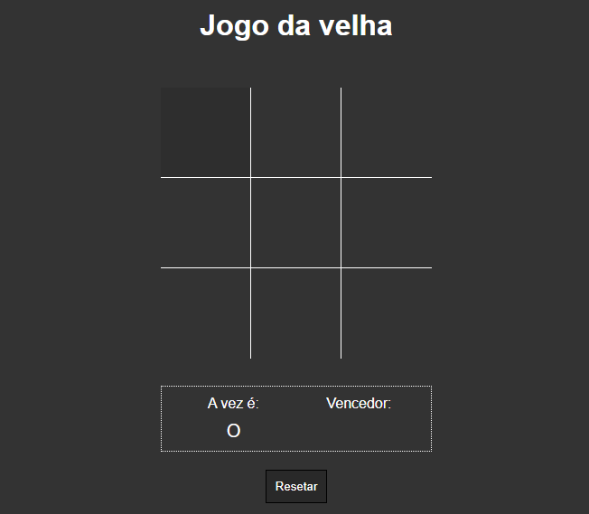
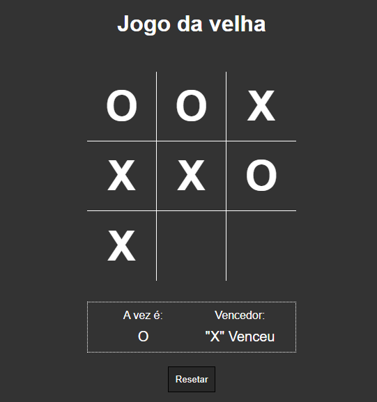

# jogo_da_velha
Esse projeto utiliza JavaScript para simular o jogo da velha.

## Minha aplicação:

## Sobre a aplicação:

O projeto utiliza JavaScript para de acordo com os clicks dos usuários na div principal se manipule os elementos HTML 
da aplicação para criar e remover os marcadores dos jogadores no tabuleiro, sendo no código um array, no qual armazena os itens 
preenchidos pelos jogadores e uma função verifica as condições de vitória.

## Por que essa aplicação?

O algoritmo do sistema foi ensinado em um workshop da empresa b7web e foi construído por mim para desenvolvimento da lógica 
de programação e do portfólio pessoal.

## Ficaria feliz com feedbacks:

E-mail: raphaeldesousalm@gmail.com  
Linkdin: https://www.linkedin.com/in/raphaellima98/
